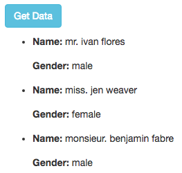

## Overview

Get data from API: http://api.randomuser.me/?results=10

And display them by React



## Installation

1.Install all node modules (build into *node_modules* folder) 

```
npm install
```

2.Start webpack-dev-server. You can change config of server (IP, port) in *package.json*. 

```
npm start  
```

3.Go to url

```
http://localhost:8080
```

